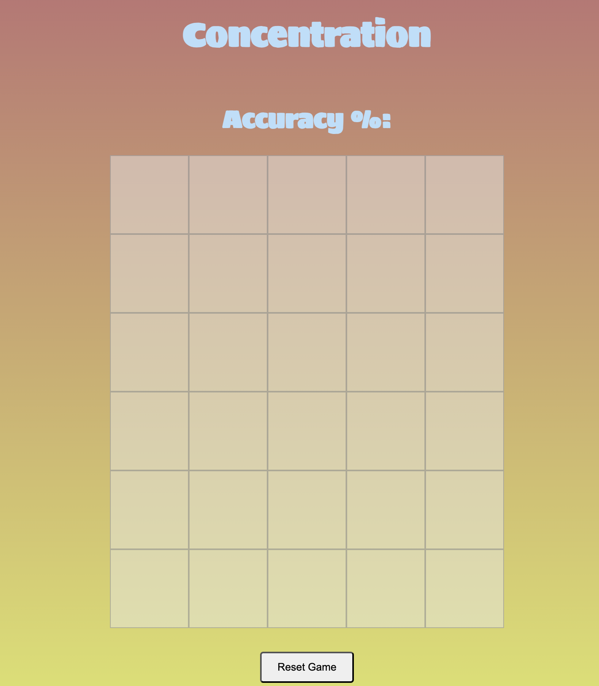

##Concentration

*The game features a 5 by 6 grid and its aim is for the user to find as many matching images in the fewest number of tries. The game is over when player accuracy dips below 55% or if all the cards have been matched.

*The game will play a sound when the player wins. 

*The game is built using HTML, CSS, and Javascript. I selected it as a simpler project because I see some similarities between it and the tic-tac-toe exercise from earlier.

Attributions: The function for the  Fisher-Yates shuffle was provided here:
[GeeksforGeeks](https://www.geeksforgeeks.org/shuffle-a-given-array-using-fisher-yates-shuffle-algorithm/)

